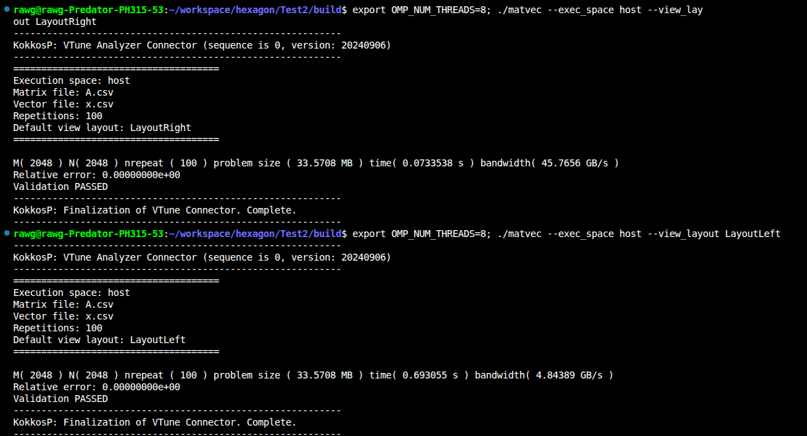
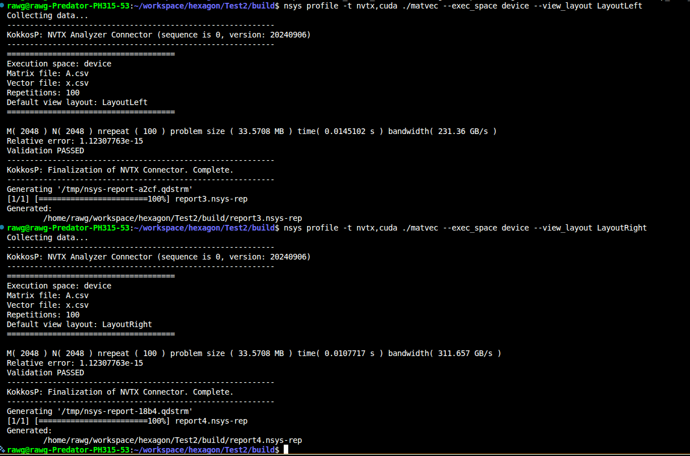
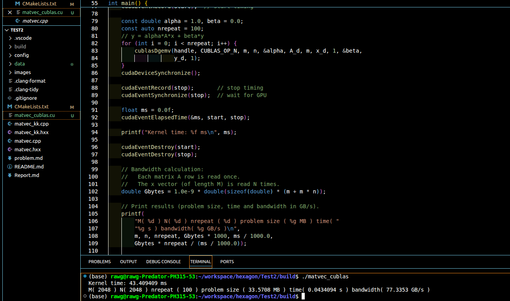
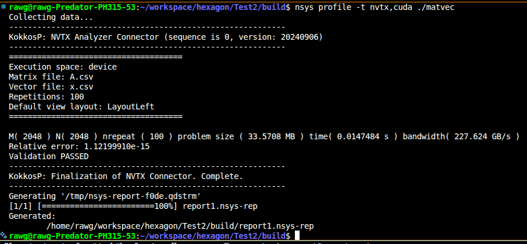
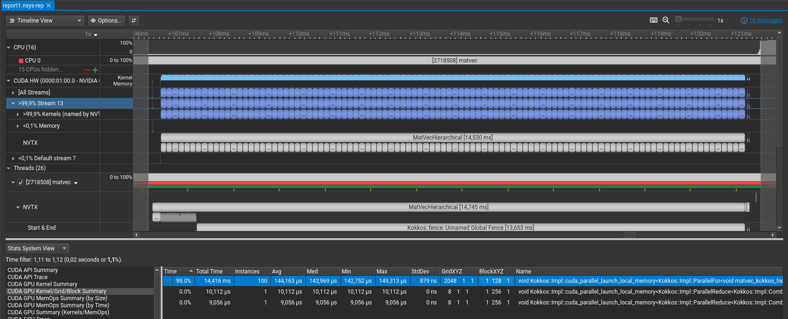
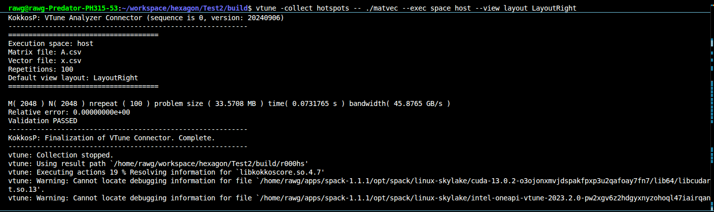
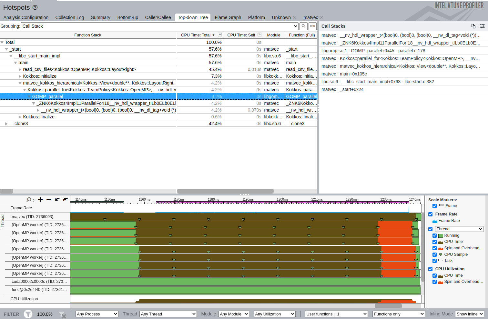
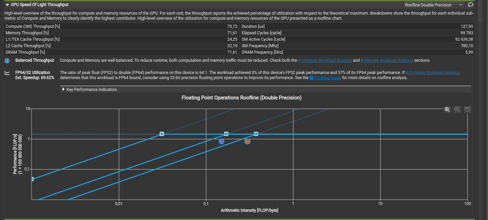

# Dense Matrix-Vector Multiplication: Implementation Report

## Overview

This project implements matrix-vector multiplication ($y = Ax$) for dense real matrices with support for both CPU (OpenMP) and GPU (CUDA) execution using the Kokkos performance portability ecosystem. The development environment is managed using Spack package manager.

## Why Kokkos?

**Kokkos** is a modern C++ performance portability framework that enables writing a single codebase that performs efficiently on diverse hardware architectures (multi-core CPUs, many-core GPUs, etc.). For this project, Kokkos was chosen for three key reasons:

### 1. **Code & Performance Portability**
Kokkos provides abstractions that allow us to write computation kernels once and compile them for multiple backends (OpenMP, CUDA, HIP, SYCL) without code duplication. This avoids maintaining separate implementations for CPU and GPU, reducing code complexity and the risk of bugs. A single `parallel_for` loop can efficiently execute on CPUs using OpenMP or on GPUs using CUDA kernels with no changes to the algorithmic logic.

### 2. **Productivity & Maintainability**
Kokkos abstracts low-level details like thread management, memory allocation, and synchronization, allowing developers to focus on algorithmic improvements. The framework handles:
- **Compilation**: Kokkos_launches the appropriate backend compiler (e.g., NVCC for CUDA) with optimal flags. The user does not need to manage separate build configurations for CPU and GPU. He can simply add the desired host compiler and device compiler flags, the nvcc_wrapper dispatches the compilation flags to the appropriate compiler based on the execution space selected at runtime. Another advantage is compiling and preparing the GPU code on host only CPU configuration in order to have a faster development cycle without avoiding long GPU compilation times.
- **Memory management**: Automatic allocation strategies per execution space (UVM for CUDA, page-locked memory for H2D transfers). In terms of memory management, one has to think also about handling object lifecycles. Kokkos::View is a lightweight wrapper around raw pointers that manages memory allocation and deallocation automatically with reference counting. Comparing the three implementations, the one with Kokkos Kernels is more maintainable as it abstracts the memory management and provides a higher-level interface for linear algebra operations, while the basic Kokkos implementation requires manual management of memory and kernel launches, and the cuBLAS implementation requires explicit handling of CUDA memory management and API calls. 
- **Scheduling**: Kokkos intelligently maps computations to hardware without manual tuning
- **Interoperability**: Easy integration with external libraries like Kokkos Kernels for optimized linear algebra operations

Maintaining a single high-level codebase is significantly easier than maintaining separate CPU and GPU implementations with different performance characteristics and potential inconsistencies. Kokkos also provides tools for debugging and profiling across platforms, further enhancing developer productivity.

Regarding code duplication and maintainability, Kokkos eliminates the need for separate code paths for CPU and GPU, ensuring that any algorithmic changes are automatically reflected across all backends. In the same linear algebra context, one may refer to Eigen Library that is a reference for CPU compuatations that supports GPU computations via CUDA and HIP duplication and didn't achieve same level of coverage with many functions not being ported and numerical accuracy issues for the ported functions.

### 3. **Performance**
Despite its abstraction layer, Kokkos achieves near-native performance through:
- Compiler optimizations specifically targeting each backend
- Well-tuned launch configurations and thread/block mappings (hits almost all GPU occupancy targets with default settings wihtout manual tuning)
- Support for hierarchical parallelism and memory hierarchies
- Access to optimized linear Algebra kernels via Kokkos Kernels library for dense, sparse, batched operations and graph algorithms.

## Project Tasks and Implementation

### Task 1: Correctness Baseline (Single-threaded Reference)
**Objective:** Implement a serial reference implementation and validate correctness.

**Implementation:**
The serial baseline computes $y = Ax$ as a straightforward nested loop:
```cpp
for (int i = 0; i < m; ++i) {
  double sum = 0.0;
  for (int j = 0; j < n; ++j) {
    sum += A(i, j) * x(j);
  }
  y(i) = sum;
}
```

**Validation:** Results from parallel implementations are compared against this baseline using relative error: $\epsilon_{rel} = \frac{\|y_{ref} - y_{computed}\|_2}{\|y_{ref}\|_2} < 10^{-12}$. This ensures numerical correctness across all implementations.

### Task 2: OpenMP Version (CPU Parallelization)
**Objective:** Parallelize across matrix rows using OpenMP and analyze performance scaling.

**Implementation:**
Same source code, using Kokkos with OpenMP backend on runtime selection with argument option "--exec_space host" and appropriate layout for row-major access 'Kokkos::LayoutRight' (c-style layout) with runtime argument "--view_layout LayoutRight".



**Key Considerations:**
- **Row-wise parallelization**: Each thread computes one or more rows independently, ensuring minimal synchronization
- **NUMA Effects**: On large systems, Kokkos' memory policies can be tuned to account for NUMA locality. It is tuned with HWLOC and settings thread binding with "spread" policy to maximize memory bandwidth utilization across NUMA domains and omp_places with "cores" to bind threads to cores and avoid oversubscription.
- **Scheduling**: Kokkos' OpenMP execution space automatically selects appropriate scheduling (static/dynamic) based on workload balance

**Performance Scaling:** Measure execution time with varying `OMP_NUM_THREADS` (1, 2, 4, 8) (laptop limit) to demonstrate strong scaling (see table below).

**Why Kokkos helps:** Unified syntax for expressing parallelism without explicit pragma management; automatic thread pool configuration.

### Task 3: GPU Version (CUDA Kernel Implementation)
**Objective:** Implement optimized CUDA kernels and analyze GPU memory access patterns.

**Implementation:**
Same source code, using Kokkos with CUDA backend enabled on runtime selection with argument option "--exec_space device" and appropriate layout for col-major access 'Kokkos::LayoutLeft' (fortran-style layout) with runtime argument "--view_layout right".

**GPU Optimization Strategies:**
  **Memory Coalescing**: Kokkos provides a handling of layouts so that consecutive threads access consecutive memory locations, maximizing coalescing efficiency
 


An excellent talk and work aligned with Kokkos::Views and mdspan layouts is provided by [Cedric Chevalier, CEA, HPSF Con 2025](https://youtu.be/_HYwIHten10?si=hM55aVu20xEK5J_t) at HPSF 2025, where he explains how to use Kokkos::Views and mdspan with different layouts to optimize memory access patterns for both CPU and GPU architectures.

In this implementation, we use a Warp-level reduction layout. Instead of one thread per row, we consider one warp per row where each lane computes partial dot product for a segment of the row and then performs a warp shuffle reduction to combine results. This approach can improve performance for larger matrices by increasing instruction-level parallelism and better utilizing GPU resources.

hat happens in one warp:
- Lane k loads A[row][k]
- Addresses are contiguous
- GPU issues one coalesced load
- Each lane computes partial sum for its segment of the row and stores the results in global memory.

The results are to be compared to cublas and Kokkos Kernels implementations for validation and performance comparison. Below is a screenshot of the console log showing the execution times and bandwith for cuBLAS that provided similar results to both Kokkos kernels implementation (internal and wrapping cuBLAS). We can observe that the warp-level approach was 5x times faster. 



  **Shared Memory Tiling** (bonus): Block threads into tiles (e.g., 32×32) that collectively load a submatrix into shared memory, reducing global memory traffic by a factor of blockDim.x
  **Launch Configuration**: Kokkos automatically selects thread blocks and grid dimensions. Typical configs: 256–512 threads per block, multiple blocks per SM
  **CUDA Events Timing**: Kokkos provides profiling tools to measure kernel execution time accurately, excluding data transfer overhead. Kokkos::profiling::push_region and pop_region can be used to mark code regions for profiling and Kokkos Tools with PAPI can be used to measure GPU performance counters hooking nvidia profiling librairies on runtime and calling CudaEvents.

For CPU profiling compile with appropriate flags (cmake config RelWithDebInfo for example), Intel VTune and Advisor can be used to analyze CPU performance, while NVIDIA Nsight Systems can be used for GPU profiling. For example, to profile the GPU execution with Nsight Systems, you can use the following command:
```bash
export KOKKOS_TOOLS_LIBS=${INSTALL_Path_to_KTOOLS}/libkp_nvtx_connector.so
nsys profile -t nvtx,cuda ./matvec
```




We can see the marked region "MatVecHierarchical" in the Nsight Systems timeline, which corresponds to the annonted region with "Kokkos::Profiling:pushRegion(MatVecHierarchical)" to hook nvidia tools and invoked NVTX annotations. We can also see from the report that Kokkos has automatically selected a Grid [2048,1,1] and Block [1,128,1] launch configuration.

 Now replacing the loaded library (ntvx connector) "libkp_nvtx_connector.so" with "libkp_vtune_connector.so" and running the same command with vtune we can have the similar Vtune report for CPU profiling.

```bash
export KOKKOS_TOOLS_LIBS=${INSTALL_Path_to_KTOOLS}/libkp_vtune_connector.so
vtune -collect hotspots -- ./matvec --exec_space host --view_layout right
```




Another profiling tool that I recommend is HPCToolkit, which is a powerful performance analysis tool that can be used to profile both CPU and GPU code. It provides detailed insights into the performance of your application, including call stacks, GPU kernel execution, and memory access patterns. You can use HPCToolkit to identify performance bottlenecks and optimize your code for better performance for codes runing OpenMP/MPI/CUDA/Python at the same time eventually.

**Memory Access Analysis:**
- **Bandwidth utilization**: Estimate as $BW = \frac{2 \cdot m \cdot n \text{ bytes}}{time \text{ (seconds)}} / 10^9$ GB/s
  
- **Roofline Model**: Compare against GPU peak FLOPs and memory bandwidth to classify as memory-bound or compute-bound

To generate a roofline plot using NVIDIA Nsight Compute, you can use the following command to profile the GPU execution and collect the necessary performance metrics:
```bash
ncu -o profile_matvec --set full ./matvec --exec_space device --view_layout LayoutRight
ncu-ui profile_matvec.ncu-rep
```

It can be observed from the generated roofline plot that the matrix-vector multiplication kernel is memory-bound, as its arithmetic intensity is low (0.25 ops/byte) and it achieves a bandwidth close to the GPU's peak memory bandwidth, but far from the peak compute performance. This indicates that optimizing memory access patterns and reducing global memory traffic (e.g., through tiling or shared memory) would be more beneficial than focusing on computational optimizations for this specific kernel.



As exepcted from GEMV, we are better that Blas 1 dot_product in terms of roofline performance but we are at communication/compute bound limit for this kernel. As expected in comparison to GEMM, there is no data reuse in GEMV and we are at the limit of the roofline performance for this kernel, while for GEMM we can have a much higher arithmetic intensity and better performance by reusing data in shared memory and registers. For more details, there is an excellent talk by [Jack Dongarra, ATPESC 2019](https://youtu.be/TPP5LavGEiI?si=lTdvzCRisKT0lQRR) that I recommend to my undergraduate student.

### Task 4: Performance Analysis
**Objective:** Measure and analyze bandwidth utilization and algorithmic efficiency.

**Metrics:**
- **Execution Time**: Average over multiple runs with warm-up iterations
- **Bandwidth**: $BW_{GB/s} = \frac{(M + M * N) \times \text{ sizeof(doubles)}}{time} / 10^9$
- **Speedup**: $S = \frac{T_{serial}}{T_{parallel}}$
  
**Expected Results (example):**

| Version                                 | Matrix Size | Time (s) | Bandwidth (GB/s) | Speedup |
| --------------------------------------- | ----------- | -------- | ---------------- | ------- |
| Serial                                  | 2048        | 0.481    | 6.97             | 1.0×    |
| OpenMP (2 threads)                      | 2048        | 0.245    | 13.66            | 1.96×   |
| OpenMP (4 threads)                      | 2048        | 0.135    | 24.75            | 3.56×   |
| OpenMP (8 threads)                      | 2048        | 0.073    | 46               | 6.62×   |
| OpenMP (8 threads) Kokkos_kernels Blas2 | 2048        | 0.075    | 44               | 6.42×   |
| GPU (RTX 3080) Kokkos_kernels Blas2     | 2048        | 0.05     | 68               | 9.62×   |
| GPU (RTX 3080) cuBlas2_v2               | 2048        | 0.043    | 78               | 9.62×   |
| GPU (RTX 3080)                          | 2048        | 0.01     | 312              | 48×     |

**Interpretation**: Matrix-vector multiply is memory-bound ($I = 0.25$ ops/byte). GPU achieves higher bandwidth due to higher memory throughput, not higher compute utilization.

### Task 5: Extensions (Bonus)
**Objective:** Further optimize using advanced techniques.

**Techniques:**
1. **Cache Blocking / Shared-Memory Tiling**: Process submatrices in GPU shared memory to reduce global memory traffic
   An example of tiling strategy is to divide the matrix into smaller tiles (e.g., 32×32) that fit into shared memory is provided in "matvec.hpp". Each thread block would load a tile of the matrix A and the corresponding segment of vector x into shared memory, perform the multiplication for that tile, and then write the results back to global memory. This approach can significantly reduce global memory accesses and improve performance, especially for larger matrices that do not fit entirely in cache. However, that warp reduction approach demonstrated to be more efficient for the matrix sizes tested in this project, but tiling can be beneficial for larger matrices or different hardware architectures of GEMM operations.
2. **Pinned Host Memory**: Use `cudaMallocHost()` for faster H2D/D2H transfers
   This part was not implemented in the current codebase, but it can be achieved in Kokkos by using `Kokkos::View` with `Kokkos::MemoryTraits<Kokkos::HostPinned>` to allocate pinned memory for the host-side vectors and matrices. This allows for faster data transfers between the host and device, which can be particularly beneficial for large matrices where transfer time can become a bottleneck.
3. **Stream Overlap**: Use CUDA streams to overlap compute and data transfer: while GPU computes on batch $i$, transfer batch $i+1$
   This part was also not implemented in the current codebase, but it can be achieved in Kokkos by creating multiple execution spaces (streams) and using them to manage concurrent data transfers and kernel executions. This approach allows for overlapping computation and data movement, improving overall performance or to limit the total amount of data that needs to be transferred and held in GPU memory if it exceeds the GPU memory limits. However, it requires careful management of dependencies between streams to ensure correctness. I have used this technique in [Muscat FE code developed at Safran](https://gitlab.com/drti/muscat/-/blob/master/cpp_src/FE/Kokkos/NativeIntegrationKokkos.hpp?ref_type=heads#L473) ([paper](https://hal-hceres.archives-ouvertes.fr/CSMA2024/hal-04823002v1))

**Implementation in Kokkos:**
- Kokkos supports views with custom memory spaces (`Kokkos::SharedSpace` for shared memory)
- Temporary allocations can use pinned memory via `MemoryTraits`
- Stream management is abstracted through execution space instances

**Expected Impact:**
- Tiling: 2–4× reduction in global memory traffic
- Pinned memory: 10–20% faster data transfer
- Stream overlap: Potential 15–25% reduction in end-to-end time for bandwidth-limited workloads


## Prerequisites

- Spack (https://spack.io) installed and configured
- A system with CUDA toolkit available (for GPU support)
- CMake 3.31 or higher
- A compatible C++ compiler (GCC 14 or later)
- Kokkos and Kokkos Kernels for matrix-vector multiplication
- Python 3 for data generation
- CLI11 for command-line argument parsing

- Ninja build system (optional, but recommended for faster builds)
- Intel VTune and Advisor for performance profiling (optional)
- nsight systems for GPU profiling (optional)
- Kokkos Tools with PAPI for performance measurement (optional)

## Setting Up the Development Environment with Spack

### Step 1: Initialize Spack Environment

Navigate to the project directory and create a Spack environment using the provided configuration:

```bash
cd /path/to/Test2
spack env create -d ./spack-env -f config/spack.yaml
```

This command creates a Spack environment in the current directory using the specifications defined in `config/spack.yaml`. The environment includes all necessary dependencies for building and running the matrix-vector multiplication kernels.

### Step 2: Activate the Spack Environment

```bash
spack env activate ./spack-env
```

This activates the environment and sets up all necessary paths and environment variables.

### Step 3: Install Dependencies

Install all required packages defined in the environment:

```bash
spack install
```

This command will:
- Install GCC 14 with binutils
- Install CUDA toolkit
- Build Kokkos 4.7.01 with CUDA and OpenMP support
- Build Kokkos Kernels 4.7.01 with CUDA support
- Build Kokkos Tools with PAPI
- Install CMake, Ninja, GDB, and CLI11
- Install Intel VTune and Advisor for profiling
- Install Python 3 and NumPy for data generation
- Handle all dependencies and their configurations as specified in the `spack.yaml` file.

The installation may take some time depending on your system and available resources.

### Step 4: Load the Environment

After installation, ensure the environment is activated:

```bash
spack env activate ./spack-env
```

## Building the Project

### Step 0: Data Generation

The project requires CSV input files for matrix A and vector x. Generate test data using:

```bash
python ./data/generate_dense.py --n 2048 --A A.csv --x x.csv
```

This creates a dense 2048×2048 matrix and vector files. Adjust `--n` parameter for different matrix sizes.

The generated CSV files are automatically copied to the build directory during the build process.

### Step 1: Create Build Directory

```bash
mkdir -p build
cd build
```

### Step 2: Configure with CMake

```bash
cmake .. -DCMAKE_BUILD_TYPE=Release -DCMAKE_CXX_FLAGS_RELEASE="-O3 -march=native -funroll-loops -funroll-all-loops -ftree-vectorize -fno-omit-frame-pointer"

```

CMake will automatically detect the installed Kokkos and other dependencies from the Spack environment.

### Step 3: Build

Using Make:

```bash
make
```

Or using Ninja (if preferred):

```bash
ninja
```

The build will create the following executables:
- `matvec` - Basic matrix-vector multiplication using Kokkos
- `matvec_stream` - Streaming matrix-vector multiplication
- `matvec_kk` - Matrix-vector multiplication using Kokkos Kernels

### Step 4: Install (Optional)

```bash
make install
```

## Running the Applications

After building, you can run the executables from the build directory:

```bash
./matvec --help
./matvec_stream --help
./matvec_kk --help
```

## Environment Configuration Details

### Default Spack Configuration (config/spack.yaml)

- **Compiler**: GCC 14 with binutils
- **Kokkos**: Version 4.7.01 with CUDA and OpenMP support
- **CUDA Architecture**: 86 (Ampere - RTX 3090, etc.), to be adjusted based on your GPU !
- **C++ Standard**: C++20
- **Kokkos Kernels**: With CUDA, but excludes CUSOLVER, CUSPARSE, and CUBLAS
- **Profiling Tools**: Kokkos Tools with PAPI, Intel VTune, and Advisor


## Troubleshooting

### If Spack environment is not activated

You'll see CMake errors about missing Kokkos. Make sure to activate the environment:

```bash
spack env activate ./spack-env
```

### Clean rebuild

To start from scratch:

```bash
rm -rf build
mkdir build
cd build
cmake ..
make
```

### Verify Spack environment

List installed packages:

```bash
spack find
```

Show environment details:

```bash
spack env status
```

## Notes

- The project uses FetchContent for CLI11 if not found via Kokkos-provided packages
- Kokkos kernel-specific features require KokkosKernels to be found during CMake configuration
- GPU execution requires CUDA-capable hardware matching the configured architecture (to be adjusted in `spack.yaml` if needed)

## References

- Kokkos Documentation: https://kokkos.github.io/
- Spack Documentation: https://spack.io/
- NVIDIA Nsight Systems: https://developer.nvidia.com/nsight-systems
- Intel VTune: https://www.intel.com/content/www/us/en/developer/tools/vtune-profiler/overview.html
- Python NumPy: https://numpy.org/doc/stable
- CLI11: https://cliutils.github.io/CLI11/
- HPCToolkit: https://hpctoolkit.org/
- Muscat FE code developed at Safran: https://gitlab.com/drti/muscat
- High Performance software Linux foundation: https://www.hpsf.org/