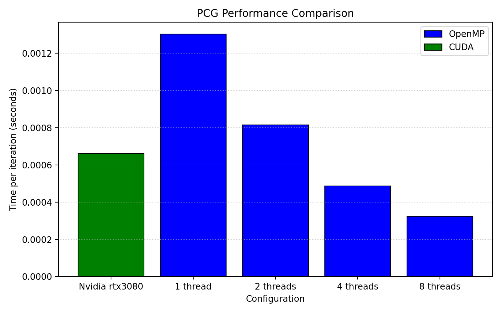
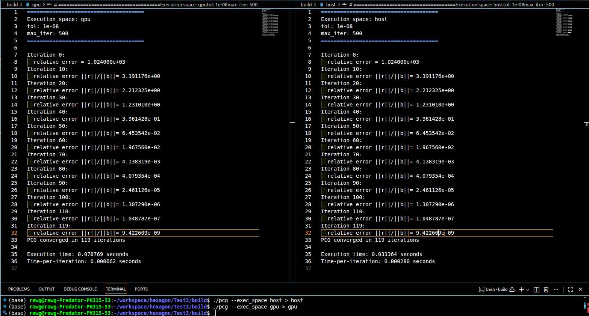
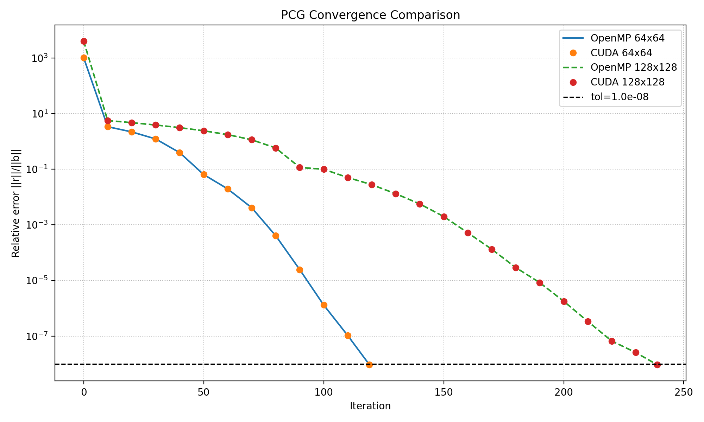

# PCG Solver for 2-D Poisson: Implementation Report

## Overview

This project implements a Preconditioned Conjugate Gradient (PCG) solver for symmetric positive definite systems arising from the 2‑D Poisson equation (5‑point finite‑difference Laplacian). The matrix `A` is stored in CSR format and input via `rowptr.csv`, `col.csv`, and `val.csv`. The solver uses a Jacobi (diagonal) preconditioner and supports CPU (OpenMP) and GPU (CUDA) execution using the Kokkos performance portability ecosystem. The development environment is managed with Spack.
## Why Kokkos?

**Kokkos** lets us write a single PCG implementation that targets both CPU and GPU backends with minimal platform-specific code. For this sparse iterative solver, Kokkos provides:

- Unified parallel primitives (`parallel_for`, `parallel_reduce`) for SpMV, vector updates, and dot-products.
- Portable memory views for CSR arrays and vectors, including host-pinned allocations for efficient H2D transfers.
- Integration points for profiling (NVTX, VTune) and for mixing custom kernels with KokkosKernels sparse utilities.

This keeps the implementation concise while enabling high performance across architectures.

### Key Implementation Tasks

The PCG implementation and report follow the tasks outlined in `problem.md`:

- Serial baseline: a reference CG/PCG implementation on the host for correctness and residual tracking.
- Sparse kernels: CSR SpMV, dot-products, AXPY-style vector updates, and Jacobi preconditioner application.
- Parallel execution: Kokkos-backed OpenMP and CUDA implementations of SpMV and vector operations.
- Convergence reporting: iteration counts and residual history (||r_k|| / ||b|| < 1e-8).
- Performance analysis: measure time-per-iteration, and discuss why SpMV is bandwidth-bound for the Poisson stencil.

The implementation uses `rowptr.csv`, `col.csv`, and `val.csv` produced by `data/generate_poisson.py` and assumes `b` is the all-ones vector unless otherwise provided.

### Performance Analysis

Metrics and methodology used in the report:

- Execution time: average of multiple runs with warm-up iterations removed.
- Convergence metrics: iteration count and residual norm history (log-plot recommended).

For 2‑D Poisson, SpMV is bandwidth-bound: the stencil yields low arithmetic intensity, so optimizing memory traffic (reordering, blocking, or prefetching) typically yields better gains than additional FLOP optimizations. Kokkos allows also to define custom layouts for the vectors to optimize memory access patterns for both CPU and GPU on stencil-based applications but it was not implemented in the current codebase. See [Cedric Chevalier, CEA, HPSF Con 2025](https://youtu.be/_HYwIHten10?si=hM55aVu20xEK5J_t) talk at HPSF 2025 on layouts for more details.

As shown below, the OPenMP implementation competes with the CUDA one, which is a good sign of performance portability. For 8 threads the CPU beats the GPU version as expected. HPL benchmark has always put at the top rank super computers accelerated with GPUs. However, when it comes to HPCG Fugaku supercomputer (Riken, Japan) which is a CPU-only supercomputer, is ranked at the top of the HPCG benchmark. This is a good example of how the performance of an application can be very different on different architectures and how it is important to have a portable code that can run efficiently on both CPU and GPU.



Why CPUs outperform GPUs on HPCG:
The HPCG benchmark emphasizes sparse linear algebra, irregular memory access, and synchronization-heavy operations (e.g., sparse matrix–vector multiplication and Gauss–Seidel preconditioning). These workloads are memory-bound with low arithmetic intensity and contain sequential dependencies, which limit effective GPU parallelism. CPUs, with sophisticated cache hierarchies, lower memory latency, and better handling of irregular access patterns, are therefore able to utilize hardware resources more efficiently than GPUs, despite GPUs having much higher peak FLOPS.

For comparison of the different hardware architectures, programming models (backends) and different applications encountered in HPC and simulation code, one may refer to [Babel Stream project](https://github.com/UoB-HPC/BabelStream).

## Iteration count vs Residual

The following logs show the convergence history for both GPU and CPU executions. The relative error (||r_k|| / ||b||) decreases steadily, with convergence achieved in 119 iterations for both backends, demonstrating correctness and consistent behavior across architectures. One can also see that not only code and performance were ported but also the convergence history (errors), which is a good sign of correctness and consistency across backends.

As the mesh is refined, the number of iterations increases as expected for a simple Jacobi preconditioner. The condition number of the Poisson matrix grows with the mesh size $\mathcal{O}(h^{-2})$, leading to slower convergence. 





## Setting Up the Development Environment with Spack

### Step 1: Initialize Spack Environment

From the project root:

```bash
spack env create -d ./spack-env -f config/spack.yaml
spack env activate ./spack-env
spack install
```

The environment will build the required compiler, Kokkos (with selected backends), KokkosKernels, and tooling as defined in `config/spack.yaml`.
## Running the PCG Solver

From `build` run the solver with the CSR files generated in `data/poisson_64x64`:

```bash
./pcg --tol 1e-8 --max-iter 500 --exec_space host
./pcg --tol 1e-8 --max-iter 500 --exec_space device
```

Use `--exec_space host` for OpenMP and `--exec_space device` for CUDA (if built).

## Environment Configuration Details

See `config/spack.yaml` for the environment specification. Typical entries control:

- Compiler (GCC 14)
- Kokkos version and enabled backends (OpenMP, CUDA)
- Kokkos Kernels enabled backends (OpenMP, CUDA)
- CUDA architecture selection (adjust to your GPU)
- C++ standard (C++20)

## Troubleshooting

- If CMake cannot find Kokkos, ensure the Spack environment is activated: `spack env activate ./spack-env`.
- For a clean rebuild: `rm -rf build && mkdir build && cd build && cmake .. && make`.
- Verify installed packages with `spack find` and `spack env status`.
## Notes

- The solver expects CSR files produced by `data/generate_poisson.py`.
- KokkosKernels can be used to compare against hand-coded SpMV implementations.

## References

- Kokkos Documentation: https://kokkos.github.io/
- Spack Documentation: https://spack.io/
- NVIDIA Nsight Systems: https://developer.nvidia.com/nsight-systems
- Intel VTune: https://www.intel.com/content/www/us/en/developer/tools/vtune-profiler/overview.html
- Python NumPy: https://numpy.org/doc/stable
- CLI11: https://cliutils.github.io/CLI11/
- HPCToolkit: https://hpctoolkit.org/
- Muscat FE code developed at Safran: https://gitlab.com/drti/muscat
- High Performance software Linux foundation: https://www.hpsf.org/

